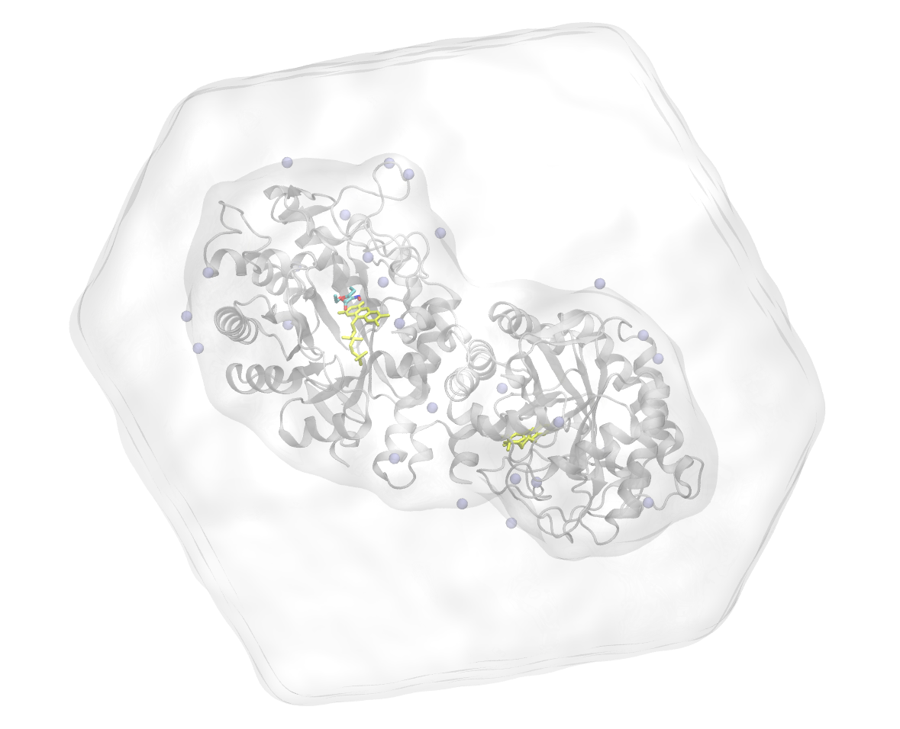

.. -*- encoding: utf-8 -*-

.. include:: /includes/defs.rst
.. include:: /includes/links.rst

************
System Setup
************

===============
Bring together!
===============

Build system with tLEap
=======================

Use the tLEap input file included in this tutorial for building a "matured" MD input system.

We are going to use:

* leaprc.protein.ff19SB for the protein
* leaprc.gaff2 for the ligand molecule
* leaprc.water.spce for the water molecules

.. code-block:: console
        :caption: Building with tLEap
        
        tleap -f 2-tleap.in

Here is the content of the :file:`tutorial/metadata/system/2-tleap.in` 

.. code-block:: bash
        :emphasize-lines: 26, 27
        :caption: Load, combine, solvate, neutralise and finally build a ready to simulate system

        # Sourcing required force-field parameters for protein, ligand and water
        source leaprc.protein.ff19SB
        source leaprc.gaff2
        source leaprc.water.spce

        # Load protein structure (Use the protonated PDB)
        protein = loadPDB tutorial/metadata/input_strucutres/wt_protein.pdb
        check protein
        
        # Load flavins parameters and structure
        loadamberparams tutorial/metadata/ff/FMH/gaff2/FMH.frcmod
        loadoff tutorial/metadata/ff/FMH/gaff2/FMH.lib
        fmn = loadpdb tutorial/metadata/input_structures/FMH.pdb
        check fmn
        
        # Load Ligand parameters and structure
        loadamberparams tutorial/metadata/ff/OHP/gaff2/OHP.frcmod
        loadoff tutorial/metadata/ff/OHP/gaff2/OHP.lib
        OHP = loadpdb tutorial/metadata/input_structures/OHP.pdb
        check OHP
        
        # Saving unsolvated dry system's pdb and parameter file
        system = combine {protein fmn OHP}
        savepdb system tutorial/metadata/system/xenA_h_OHP_dry.pdb
        saveamberparm system tutorial/metadata/system/xenA_h_OHP_dry.prmtop tutorial/metadata/system/xenA_h_OHP_dry.rst7
        
        # Solvate using a preconfigured water model box
        solvateOct system SPCBOX 10 iso
        
        # Neutralise by adding counter ions
        addions2 system Cl- 0
        addions2 system Na+ 0
        
        # Save AMBER input files for solvated and neutralised system
        savePDB system tutorial/metadata/system/xenA_h_OHP.pdb
        saveamberparm system tutorial/metadata/system/xenA_h_OHP.parm7 tutorial/metadata/system/xenA_h_OHP.rst7
        quit
     

Here is the final system, we just build

        
        The final fully "matured" system. Its a octahedral box, where water molecules shown as transparent surface, protein in 
        gray cartoon, ions in light blue, flavin and OHP in yellow and cyan, respectively.

        

