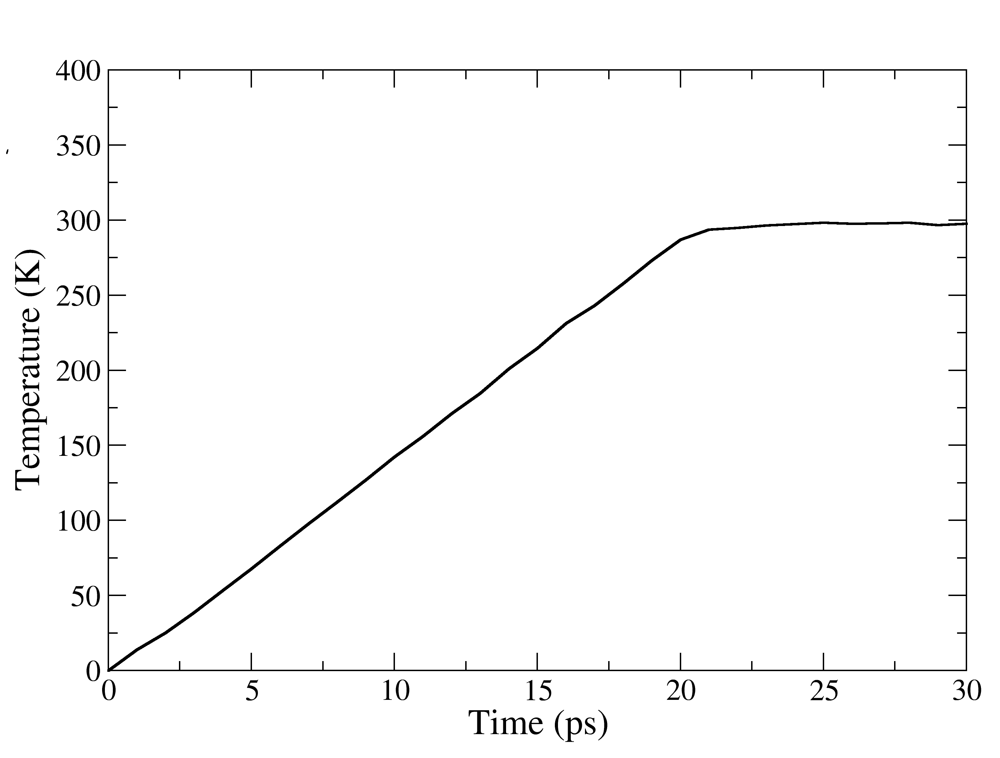

.. -*- encoding: utf-8 -*-

.. include:: /includes/defs.rst
.. include:: /includes/links.rst

*****************
Settle the System
*****************

===================================================
Removing bad atomic contacts and minimizing vaccum!
===================================================

We have just modelled a "matured" system, means we have placed all required molecules in a box. This step-wise placement could lead 
to overlapping atomic positions or very close atomic contacts or very far atomic postions, this could results in atomic replusion or
can forbidden possible atomic interactions too. To minimize these positional artifacts energy minimisation is a 
crucial step before proceeding further. Essentially, we are going to use the potential energy terms derived from the force-field, 
that will use the 3D coordinate as input and will try to optimise the positions of atoms, so that any clashes or
vaccum therein will be minimsed.

Breifly, the system will undergo sequentially through steps:

1. Classical Energy Minimization
        * Will try to optimize the psotion of atoms using the supplied molecular mechanics parameters e.g. bond-length, angle, van-der-waal etc

.. code-block:: 
        :emphasize-lines: 7,8
        :caption: Step 1 --> Classical Minimization

        Minimisation of system
        &cntrl
        imin=1,        ! Perform an energy minimization.
        maxcyc=4000,   ! The maximum number of cycles of minimization.
        ncyc=2000,     ! The method will be switched from steepest descent to conjugate gradient after NCYC cycles.
        ntr=1,         ! Enabling restraints
        restraint_wt = 10,          ! 10 kcal/mol/A**2 restraint force constant
        restraintmask = '!@H=&!:WAT,Na+' ! Restraints on the solute heavy atom
         /
        
We are aiming to preserve the heavy atom positions, for this we are using a small restraint (10 kcal/mol/A^2) on the protein's heavy atom. You can commentout the highlighted lines (just add ! in the begining) if you wanna minimise all atoms.       
                
2. Thermalisation
        * Kinetic energy or say the dynamics of the atoms increased step-wise
        
.. code-block:: 
        :emphasize-lines: 21,22
        :caption: Step 2 --> Thermalisation or Gradual Heating

        Heating ramp from 0K to 298K
        &cntrl
        imin=0,                   ! Run molecular dynamics.
        ntx=1,                    ! Initial file contains coordinates, but no velocities.
        irest=0,                  ! Do not restart the simulation, (only read coordinates from the coordinates file)
        nstlim=15000,             ! Number of MD-steps to be performed.
        dt=0.002,                 ! Time step (ps)
        ntf=2, ntc=2,             ! Constrain lengths of bonds having hydrogen atoms (SHAKE)
        tempi=0.0, temp0=298.0,   ! Initial and final temperature
        ntpr=500, ntwx=500,       ! Output options
        cut=8.0,                  ! non-bond cut off
        ntb=1,                    ! Periodic conditiond at constant volume
        ntp=0,                    ! No pressure scaling
        ntt=3, gamma_ln=2.0,      ! Temperature scaling using Langevin dynamics with the collision frequency in gamma_ln (ps−1)
        ig=-1,                    ! seed for the pseudo-random number generator will be based on the current date and time.
        ntr=1,                    ! Turn on positional restraints
        restraint_wt = 10,        ! 10 kcal/mol/A**2 restraint force constant
        restraintmask = '!@H=&!:WAT,Na+' ! Restraints on the backbone heavy atom
        nmropt=1,                 ! NMR options to give the temperature ramp.
        /
        &wt type='TEMP0', istep1=0, istep2=10000, value1=0.0, value2=298.0 /
        &wt type='TEMP0', istep1=10001, istep2=15000, value1=298.0, value2=298.0 /
        &wt type='END' /
        
Its a 30 ps NVT equilibration where the temperature has been linearly increased from 0 to 298K from begining to 20 ps and for the rest of 10 ps, temperature will remain constant at 298K. Let's see if this is true or not!

        Figure showing the changes in the temperature vs Time (ps), during thermalisation. Upto 20 ps its an linear increase thereafter remained at 298K.
        
3. Equilibration Run
        * Allowing the system to breathe for 100 ps, more precisely no restraint!

.. code-block:: 
        :emphasize-lines: 18,19
        :caption: A short equilibration

        Density equilibration
        &cntrl
        imin= 0,                       ! Run molecular dynamics.
        nscm= 1,                     ! Remove translational motion after specified steps
        nstlim=50000,                  ! Number of MD-steps to be performed.
        dt=0.002,                      ! Time step (ps)
        irest=1,                       ! Restart the simulation and read coordinates
        ntx=5,                         ! Initial file contains coordinates and veloci
        ntpr=500, ntwx=500, ntwr=500,  ! Output options
        cut=8.0,                       ! non-bond cut off
        temp0=298,                     ! Temperature
        ntt=3, gamma_ln=3.0,           ! Temperature scaling using Langevin dynamics
        ntb=2,                         ! Periodic conditiond at constant pressure
        ntc=2, ntf=2,                  ! Constrain lengths of bonds having hydrogen a
        ntp=1, taup=2.0,               ! Pressure scaling
        iwrap=1, ioutfm=1,             ! Output trajectory options
        ntr=1,                         ! Enabling restraints
        restraint_wt = 10,          ! 10 kcal/mol/A**2 restraint force constant
        restraintmask = '!@H=&!:WAT' ! Restraints on the solute heavy atom
        /
        
This is a usual NPT run for 100 ps. Just to allow the solvent and hydrogen atoms to explore their neighbourhood.
        
4. SQM-MM Energy Minimization
        * A part of the system treated with Semi-Empirical Method, rest of the system still under the classical ff

.. code-block:: 
        :emphasize-lines: 13,14,15,19
        :caption: SQM-MM Minimization

        Initial min of our structure QMMM
        &cntrl
        imin=1,                       ! Perform an energy minimization.
        maxcyc=1000,                  ! The maximum number of cycles of minimization.
        ncyc=500,                     ! The method will be switched from steepest descent to conjugate gradient after NCYC cycles.
        ntb=1,                        ! Periodic conditiond at constant volume
        cut=8.0,                      ! 8 angstrom classical non-bond cut off
        ntpr=100, ntwx=100,           ! Output options
        ntc=2, ntf=2,                 ! Constrain lengths of bonds having hydrogen atoms (SHAKE)
        ifqnt=1                       ! Enable Quantum Module
        /
        &qmmm
        qmmask       = ':723|@10985-11005,11009-11010,11014-11015,11018-11023,416-429,2630-2640,2677-2687,2701-2715',  ! Include the full side-chain of Y27,H178,H181,Y183,iso-oxazoline ring, and oxime',
        qm_theory    = 'PM6-DH+',     ! Name of SQM method to use, please look in amber manual for available options
        qmcharge     =  -1,           ! Total charge on the atoms defined in the SQM regions
        qmmm_int     =   1,           ! For Electronic embedding
        qm_ewald     =   0,           ! Switch off Ewald summation and PME for SQM-MM interactions 
        writepdb     =   1,           ! Write a pdb file showing the atoms selected in the SQM region, a good choice to verify selected atoms
        /
        
        
5. QM-MM Energy Minimization
        * A part of interest uses QM and rest is still under classical ff
        
.. code-block:: 
        :emphasize-lines: 13,14,15,24,25,26,27
        :caption: QM-MM Energy Minimization

        Initial min of our structure QMMM
        &cntrl
        imin=1,                        ! Perform an energy minimization.
        maxcyc=500,                    ! The maximum number of cycles of minimization.
        ncyc=250,                      ! The method will be switched from steepest descent to conjugate gradient after NCYC cycles.
        ntb=1,                         ! Periodic conditiond at constant volume
        ntpr=50, ntwx=50,              ! Output options
        cut=8.0,                       ! 8 angstrom classical non-bond cut off
        ntc=2, ntf=2,                  ! Constrain lengths of bonds having hydrogen atoms (SHAKE)
        ifqnt=1                        ! Enable QM-MM
        /
        &qmmm
        qmmask       = ':723|@10985-11005,11009-11010,11014-11015,11018-11023,416-429,2630-2640,2677-2687,2701-2715', ! Include the full side-chain of Y27,H178,H181,Y183,iso-oxazoline ring, and oxime',
        qm_theory    = 'EXTERN'        ! Opt for external QM software 
        qmcharge     =  -1,            ! Total charge on the atoms defined in the QM regions
        qmmm_int     =   1,            ! For Electronic embedding
        qm_ewald     =   0,            ! Switch off Ewald summation and PME for QM-MM interactions
        printcharges =   1,            ! Option to print the atomic charges of QM atoms in mdout file
        writepdb     =   1,            ! Write a pdb file showing the atoms selected in the SQM region, a good choice to verify selected atoms
        verbosity    =   1,            ! Level of information to be printed in mdout for selected QM atoms
        qmshake      =   0,            ! Turn off shake on QM selected QM atoms
        /
        &tc                            ! Syntax for using TeraChem as external QM software 
        method       = 'B3LYP',        ! Choice of QM theory
        basis        = '6-31G*',       ! Basis set
        ngpus        =  2,             ! Choice for number of GPUs to use for TeraChem
        gpuids       = 0,1,            ! Specify the GPU id's 
        use_template =  0,             ! No template specified for TeraChem input
        /
        
We have used a script to automtise the above step. If you are following these steps for the first time, do not run this script blindly. Be aware that it depends on the system to system, how much and which equilibration you need. Especially for a completely user-build system, unlike a crystal structure you need extra equiliration time. 

Here is the content of the :file:`tutorial/metadata/system/2-tleap.in` 

.. code-block:: csh
        :emphasize-lines: 20, 26, 31, 36, 41
        :caption: Minimize, equilibrate and run!
        
        #!/bin/csh

        # Written By Amit Singh. This script is for the automation of amber simulations

        # Please change the variable below according to your system

        set system = xenA_h_OHP
        set amber = pmemd.cuda
        set init = xenA_h_OHP

        # These are just naming convention for different steps we are going to use 
        set mdin_prefix  = mdin
        set mini_prefix  = step1.0_mm_mini
        set heat_prefix  = step2.0_thermalisation
        set equi_prefix  = step3.0_equilibration
        set sqm_prefix   = step4.0_sqm_min
        set qmmm_prefix  = step5.0_qmmm_min

        # Step 1 --> Classical Minimization
        # If there is a problem during minimization using pmemd.cuda, please try to use pmemd only for
        # the minimization step.
        if ( ! -e ${mini_prefix}.rst7 ) then
        ${amber} -O -i ${mdin_prefix}/sander_min.in -p ${init}.parm7 -c ${init}.rst7 -o ${mini_prefix}.mdout -r ${mini_prefix}.rst7 -inf ${mini_prefix}.mdinfo -ref ${init}.rst7
        endif
        # Step 2 --> Thermalisation
        if ( ! -e ${heat_prefix}.rst7 ) then
        ${amber} -O -i ${mdin_prefix}/sander_heat.in -p ${init}.parm7 -c ${mini_prefix}.rst7 -o ${heat_prefix}.mdout -r ${heat_prefix}.rst7 -inf ${heat_prefix}.mdinfo -ref ${mini_prefix}.rst7 -x ${heat_prefix}.nc
        endif

        # Step 3 --> A Short 100ps Equilibration Run
        if ( ! -e ${equi_prefix}.rst7 ) then
        ${amber} -O -i ${mdin_prefix}/sander_equil.in -p ${init}.parm7 -c ${heat_prefix}.rst7 -o ${equi_prefix}.mdout -r ${equi_prefix}.rst7 -inf ${equi_prefix}.mdinfo -ref ${heat_prefix}.rst7 -x ${equi_prefix}.nc
        endif

        # Step 4 --> Energy Minimization using Semi-Empirical Appraoch (SQM-MM)
        if ( ! -e ${sqm_prefix}.rst7 ) then
        sander -O -i ${mdin_prefix}/sqm_min.in -p ${init}.parm7 -c ${equi_prefix}.rst7 -o ${sqm_prefix}.mdout -r ${sqm_prefix}.rst7 -inf ${sqm_prefix}.mdinfo -ref $#{equi_prefix}.rst7 -x ${sqm_prefix}.nc
        endif

        # Step 5 --> Energy Minimization using Quantum Mechanical Method (QM-MM)
        if ( ! -e ${qmmm_prefix}.rst7 ) then
        sander -O -i ${mdin_prefix}/qmmm_min.in -p ${init}.parm7 -c ${sqm_prefix}.rst7 -o ${qmmm_prefix}.mdout -r ${qmmm_prefix}.rst7 -inf ${qmmm_prefix}.mdinfo -ref ${sqm_prefix}.rst7 -x ${qmmm_prefix}.nc
        endif

Here is the final system, we just build and minimised

        

